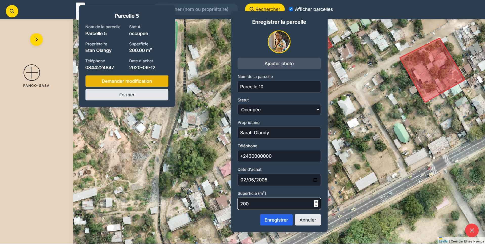
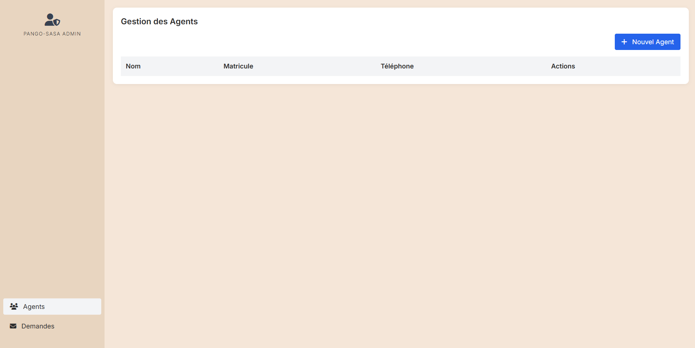

# 🎯 PANGO-SASA

Cette application offre une cartographie d'une commune de la RDC, en intégrant un système de gestion des parcelles, afin d'aider les agents cadastraux à mieux se repérer sur terrain et de ne plus dépendre de méthode archaïque .


## 📸 Aperçu du projet


> *(ou mettre un lien web si l’image est hébergée ailleurs)*  
> 


## 🚀 Fonctionnalités principales

- 🔐 Authentification sécurisée


- 📍 Géolocalisation des parcelles et traçage de polygone autour des parcelles


- 🧾 Impression de reçus PDF
- 👤 Rôles utilisateurs (admin, agent cadastral)



## 🛠️ Technologies utilisées

- PHP
- MySQL
- JavaScript
- Leaflet
- Tailwind CSS 


## 📦 Installation locale

```bash
git clone https://github.com/Imperial-your-coder/PANGO-SASA.git
cd PANGO-SASA
